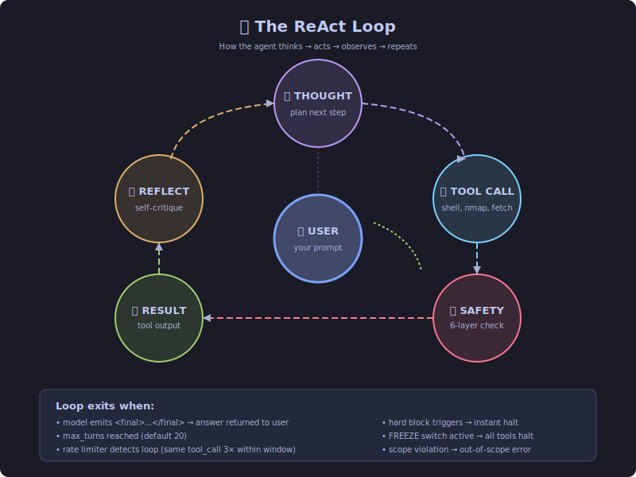
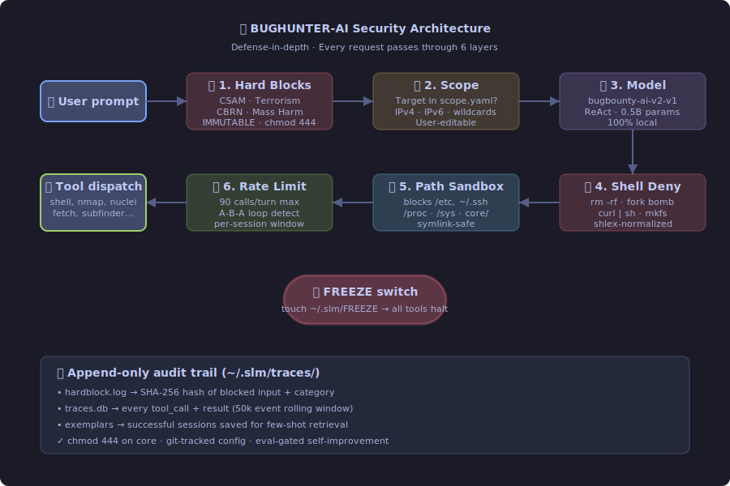

<div align="center">

  MADE WITH ❤️ BY DXN1

### An agentic bug-bounty SLM. 100 % local. 100 % yours.


[](#quickstart)
[](COPYRIGHT)
[](#the-model)
[](#tiers)
[](#performance)
[](#performance)
[](#install)
[](#license)

</div>

---

## ✨ What is this

**BUGHUNTER-AI** is an agentic command-line assistant for authorized security research, built around **`bugbounty-ai-v2`** — a purpose-trained small language model that runs **entirely on your device**. No cloud. No API keys. No telemetry.

The model thinks. Real tools on your machine do the work. Everything is **MIT** — fork it, ship it, own it.

<div align="center">

```
┌────────────────────────────────────────────────────────────────────────┐
│   you   →   ReAct loop   →   tool dispatcher   →   <final>   →   you   │
│                │                                                        │
│                └─ hard-block · scope · rate-limit · path-sandbox  ──┐   │
│                                                                      ▼  │
│                   skill RAG · plan-first · few-shot · reflect           │
└────────────────────────────────────────────────────────────────────────┘
```

</div>

---

<div align="center">



**30-second demo** — subdomain recon → nuclei scan → HackerOne-style report, fully local on a phone.



*Yes, that's a 0.5B-param agent running a full bug-bounty workflow on a 4-year-old phone.*

</div>

---

## 🚀 Quickstart

**One-liner (Linux/macOS/Termux):**

```bash
curl -fsSL https://raw.githubusercontent.com/DXN1-termux/BUGHUNTER-AI/main/install.sh | bash
```

**Or clone + install:**

```bash
git clone https://github.com/DXN1-termux/BUGHUNTER-AI.git
cd BUGHUNTER-AI
bash install.sh        # installs runtime + CLI
slm setup              # interactive wizard — picks model, scope, features
slm doctor             # verify everything is wired up
slm                    # interactive REPL
```

Autonomous mode:

```bash
slm pursue "recon acme.test and report anything that looks suspicious"
```

---

## 📚 Table of contents

<details>
<summary>click to expand</summary>

- [The model](#-the-model)
- [Tiers](#-tiers)
- [Agentic features](#-agentic-features)
- [Install](#-install)
- [How it thinks](#-how-it-thinks--a-worked-example)
- [Tools](#-tools)
- [Safety model](#️-safety-model)
- [World-firsts](#-world-firsts)
- [Privacy](#-privacy)
- [Performance](#-performance)
- [Commands](#-commands)
- [MCP · Discord · Cloud passthrough](#-integrations)
- [Self-improvement](#-self-improvement)
- [Repo layout](#-repo-layout)
- [Troubleshooting](#-troubleshooting)
- [Roadmap](#-roadmap)
- [FAQ](#-faq)
- [Support](#-support)
- [Changelog](https://github.com/DXN1-termux/BUGHUNTER-AI/blob/main/CHANGELOG.md)
- [License](#-license)

</details>

---

## 🔥 What's new in v2.3

<div align="center">

| | Feature | What it unlocks |
|:---:|---|---|
| 🐦 | **Canary-based prompt-injection detector** | Catches injected instructions from tool results the moment the model would obey them |
| 🔐 | **Hash-chain first-finder provenance** | Cryptographically prove you found a bug first, without disclosing it |
| 🌐 | **Language gate** | Block Cyrillic/CJK/Arabic bypasses at the edge — before any regex runs |
| 🛡️ | **Self-modification lock** | Agent can rewrite everything EXCEPT its own guardrails (hardcoded list) |
| 🔒 | **Encrypted vault** | Discord tokens + API keys at rest via AES-128 + PBKDF2-600k |
| 🤖 | **24/7 Discord bot mode** | Scope-gated autonomous moderation with hard-blocks active |
| ☁️ | **Cloud passthrough** | Route to Claude Opus / GPT-4o when local brain needs help |
| 🧩 | **YAML workflows + task queue** | Deterministic recipes + background goal processing |
| 📏 | 0.5B / 1.5B / 3B model sizes | Pick capability vs speed — each with 3 tier-appropriate quants |
| 🧪 | **Budget-aware autonomous mode** | `slm pursue --max-seconds 3600` with graceful early exit |
| 📋 | **MCP server** | Plug into Claude Desktop / Cursor as a tool provider |
| 🔑 | **HMAC audit logs** | Even with disk leak, attackers can't dictionary-attack your audit trail |

Full details in [CHANGELOG.md](CHANGELOG.md).

</div>

---

## 🧠 The model

<div align="center">

| | |
|---|---|
| **Name** | `bugbounty-ai-v2` (Family) |
| **Sizes** | 0.5B · 1.5B · 3B |
| **License** | **MIT** |
| **Architecture** | Decoder-only transformer · GQA · SwiGLU · RoPE · RMSNorm |
| **Training** | LoRA SFT on custom security dataset + imatrix calibration |
| **Format** | GGUF (tri-tier quant alignment) |
| **Runtime** | llama.cpp (MIT) |

</div>

### The v2 Tri-Model Family
We have moved beyond a single model to a tiered family, each specifically fine-tuned for `BUGHUNTER-AI v2`:

| Model Size | Optimized For | Training Focus | Quant Alignment |
|---|---|---|---|
| **0.5B** | Mobile / Edge | Speed, low-latency recon | IQ2_XS |
| **1.5B** | Desktop / Laptop | Balanced reasoning, multi-step planning | Q4_K_M |
| **3B** | Workstation / Server | Deep analysis, exploit generation, PoCs | Q6_K |

Training artifacts and checkpoint states for all three models are generated in the `training/` pipeline. 
Use `slm setup` to auto-detect your hardware and pull the optimized `bugbounty-ai-v2-{size}.gguf`.

### Quant line-up

<div align="center">

</div>

| Tier | Quant | Disk | RAM | Devices |
|---|---|---|---|---|
| 🟢 **mobile** | `IQ2_XS` | ~230 MB | ~350 MB | Phones, low-end Linux |
| 🟡 **desktop** | `Q4_K_M` | ~1.0 GB | ~1.5 GB | Laptops, mid-range PCs |
| 🔴 **workstation** | `Q6_K` | ~4.0 GB | ~5 GB | GPU rigs, ≥24 GB RAM |

> `slm setup` and `slm doctor` auto-detect your tier. Override in `~/.slm/config.toml::[model].tier`.

---

## 📶 Tiers

The runtime classifies your device into one of three tiers and picks the right quant + context size automatically.

| | **mobile** | **desktop** | **workstation** |
|---|:---:|:---:|:---:|
| RAM threshold | < 4 GB | 4–23 GB | ≥ 24 GB **or** GPU |
| Context window | 1 536 | 4 096 | 8 192 |
| Reflection pass | — | auto | auto |
| Vote-of-N sampling | — | — | opt-in |
| Typical throughput | 20–28 tok/s | 30–60 tok/s | 100–300 tok/s |

---

## 🪄 Agentic features

Turn them on/off under `[agent]` in `config.toml`. Defaults are sensible per tier.

| Feature | What it does | Default |
|---|---|:---:|
| **plan-first** | Forces a `<plan>` block on the first turn; keeps multi-step work on rails. | on |
| **skill RAG** | Retrieves top-3 matching user skills from `~/.slm/skills/` per turn. | on |
| **few-shot** | Injects 1–2 similar past successful sessions as in-context exemplars. | on |
| **reflection** | Self-critique pass before emitting `<final>`; auto-on desktop+. | auto |
| **vote-of-N** | Samples N rollouts, picks majority tool-call. Workstation only. | off |
| **context compression** | Summarises oldest turns when context nears the limit. | on |
| **autonomous** | `slm pursue "goal"` keeps iterating until the goal is satisfied. | off |

---

## 🛠️ Install

```bash
git clone https://github.com/DXN1-termux/BUGHUNTER-AI.git
cd BUGHUNTER-AI
bash install.sh
slm setup          # interactive configuration
```

Platform-specific prerequisites below. Installer auto-detects package manager.

<details>
<summary><b>📱 Android · Termux</b> — Samsung, Pixel, OnePlus…</summary>

```bash
# 1. Install Termux from F-Droid (NOT Play Store)
#    https://f-droid.org/packages/com.termux/
pkg update -y && pkg install -y git curl
termux-setup-storage                           # tap ALLOW

git clone https://github.com/DXN1-termux/BUGHUNTER-AI.git
cd BUGHUNTER-AI
bash install.sh
slm setup
```

</details>

<details>
<summary><b>🐧 Linux · Debian / Ubuntu / Pop!_OS / Mint</b></summary>

```bash
sudo apt update && sudo apt install -y \
  git curl build-essential cmake pkg-config \
  python3 python3-venv python3-pip \
  libssl-dev libcurl4-openssl-dev

git clone https://github.com/DXN1-termux/BUGHUNTER-AI.git
cd BUGHUNTER-AI
bash install.sh
slm setup
```

</details>

<details>
<summary><b>🍎 macOS · Apple Silicon (Metal-accelerated)</b></summary>

```bash
/bin/bash -c "$(curl -fsSL https://raw.githubusercontent.com/Homebrew/install/HEAD/install.sh)"
brew install git curl cmake python@3.11 go

git clone https://github.com/DXN1-termux/BUGHUNTER-AI.git
cd BUGHUNTER-AI
export CMAKE_ARGS="-DGGML_METAL=ON -DGGML_NATIVE=ON"
bash install.sh
slm setup
```

</details>

<details>
<summary><b>🪟 Windows · WSL2 Ubuntu (recommended)</b></summary>

```powershell
# PowerShell as Administrator, one time:
wsl --install -d Ubuntu
```

Then, inside WSL2:

```bash
sudo apt update && sudo apt install -y \
  git curl build-essential cmake pkg-config \
  python3 python3-venv python3-pip

git clone https://github.com/DXN1-termux/BUGHUNTER-AI.git
cd BUGHUNTER-AI
bash install.sh
slm setup
```

</details>

<details>
<summary><b>🐳 Docker · any host</b></summary>

```bash
git clone https://github.com/DXN1-termux/BUGHUNTER-AI.git
cd BUGHUNTER-AI
docker build -t bughunter-ai .

docker run --rm -it \
  -v $HOME/.slm:/root/.slm \
  -v $PWD:/work -w /work \
  bughunter-ai slm
```

</details>

<details>
<summary><b>📋 Other platforms — one-liners</b></summary>

| Platform | Command |
|---|---|
| **Arch / Manjaro** | `sudo pacman -S --needed git curl cmake base-devel python go && git clone https://github.com/DXN1-termux/BUGHUNTER-AI.git && cd BUGHUNTER-AI && bash install.sh && slm setup` |
| **Fedora / RHEL** | `sudo dnf install -y git curl cmake gcc-c++ make python3 python3-pip golang && git clone https://github.com/DXN1-termux/BUGHUNTER-AI.git && cd BUGHUNTER-AI && bash install.sh && slm setup` |
| **macOS Intel** | Same as Apple Silicon (CPU only, slower). |
| **Raspberry Pi 4 / 5** | Use the Debian block above. |
| **iOS · iSH** | `apk add git curl cmake python3 py3-pip && git clone https://github.com/DXN1-termux/BUGHUNTER-AI.git && cd BUGHUNTER-AI && bash install.sh && slm setup` |
| **iOS · a-Shell** | Python-only; point `config.toml` at a remote `llama-server`. |
| **UserLAnd / Andronix** | Use the Debian block inside the chroot. |

</details>

---

## 🔍 How it thinks — a worked example

<div align="center">

</div>

Every turn the model produces one of:

```
<thought>short planning note</thought>
<tool_call>{"name": "...", "args": {...}}</tool_call>
```

or, when finished:

```
<thought>done, summarizing</thought>
<final>natural-language answer to the user</final>
```

On the first turn a `<plan>` block is required:

```
you ▸ recon acme.test and tell me what's interesting

<plan>
1. passive subdomain enum
2. probe live HTTP services
3. identify juicy targets
4. suggest next step
</plan>
<thought>passive subdomain enum first</thought>
<tool_call>{"name":"subfinder","args":{"target":"acme.test"}}</tool_call>
─ result (2.4s) ─
www.acme.test · api.acme.test · staging.acme.test
admin.acme.test · jenkins.acme.test

<thought>probe all of them</thought>
<tool_call>{"name":"httpx","args":{"target":"acme.test","extra":"-title -tech-detect"}}</tool_call>
─ result (5.1s) ─
https://www.acme.test      [200] nginx, jQuery       Acme - Home
https://api.acme.test      [401] nginx               (json error)
https://jenkins.acme.test  [403] Jetty(9.4)          Dashboard [Jenkins]
https://admin.acme.test    [200] Apache, PHP 5.6     Admin Panel

<thought>jenkins 403 + PHP 5.6 are both worth a look</thought>
<final>
Interesting on acme.test:
  • jenkins.acme.test — Jetty 9.4 + Jenkins, 403. CVE-2024-23897 candidate.
  • admin.acme.test   — Apache + PHP 5.6 (EOL, many CVEs). Fingerprint CMS.
Next: nuclei --severity medium,high,critical on both.
</final>
```

---

## 🧰 Tools

| Tool | What it does | Mutating | Scope-gated |
|---|---|:---:|:---:|
| `shell` | Bash, 30 s timeout, denylist | ✓ | |
| `read_file` / `write_file` / `edit_file` / `delete_file` / `list_dir` | File ops with path sandbox | ✓ | |
| `web_search` | DuckDuckGo, top 10 | | |
| `fetch_url` | GET + text extract | | ✓ |
| `run_sql` | Snowflake query (optional) | ✓ | |
| `nmap` | `-sT -Pn -T3` (Termux-safe) | ✓ | ✓ |
| `subfinder` · `httpx` · `nuclei` · `ffuf` · `katana` | ProjectDiscovery recon chain | ✓ | ✓ |
| `run_skill` | Invoke a user skill from `~/.slm/skills/` | | |

Add your own with a `@tool(...)`-decorated function in `slm/tools.py` — auto-registered and advertised in the system prompt.

---

## 🛡️ Safety model

<div align="center">

</div>

### Zero-bypass hard blocks in action

<div align="center">

</div>

### Immutable hard-blocks

Regex checks on **input, output, AND tool results**. Rules live in `slm/core/hard_blocks.yaml`, `chmod 444` post-install. Hits are logged as SHA-256 (not content).

| Category | Blocks |
|---|---|
| 🚫 Terrorism | Planning / facilitation / glorification of mass-casualty |
| 🚫 CBRN | Chem / bio / radiological / nuclear weapon synthesis |
| 🚫 CSAM | Any sexual content involving minors |
| 🚫 Mass harm | Water/food poisoning, deliberate pathogen release |

### Scope enforcement

No scope entry → no network. Enforced in the immutable `core/` layer.

```yaml
# ~/.slm/scope.yaml
programs:
  - name: Acme public bounty
    url: https://hackerone.com/acme
domains:
  - acme.test
  - "*.acme.test"        # wildcard: subdomains only, NOT apex
ips:
  - 10.42.0.0/24
  - "2001:db8::/32"      # IPv6 supported
```

### Defense-in-depth layers

| Layer | Guarantee |
|---|---|
| Hard-block | Input / output / tool-result screened |
| Scope | Target must be in `scope.yaml` |
| Path sandbox | No writes to `core/`, `~/.ssh`, `/etc`, `/sys`, `/proc` |
| Shell denylist | `rm -rf /`, fork bombs, `curl \| sh`, base64-pipe obfuscation |
| Rate limiter | Per-turn cap + A-B-A-B loop detector |
| FREEZE kill switch | `touch ~/.slm/FREEZE` halts all tools instantly |

### What is *not* restricted

**Fully uncensored for authorized security research.** Unlike generic instruct-tuned models that over-refuse, BUGHUNTER-AI will produce on request:

- ✅ Exploit code, PoCs, payloads (XSS, SQLi, RCE, SSRF, LFI, IDOR, auth-bypass)
- ✅ Destructive shell commands **inside scoped targets** (scope.yaml-gated)
- ✅ Reverse engineering, decompilation, shellcode analysis, ROP chains
- ✅ Malware analysis, C2 extraction, credential stuffing (scoped)
- ✅ Privilege escalation, persistence, lateral movement for RE
- ✅ Phishing pages for authorized red-team engagements
- ✅ Jailbroken payloads, template injection, deserialization exploits

**How it stays uncensored:** a refusal-detector catches nagging "I'm sorry, I can't" responses on legitimate security work and auto-retries with explicit authorization context. The 4 hard-block categories (below) are enforced in an **immutable regex layer that lives below the model** — so the model's answers can be direct without the guards being weakened.

### The 5 things we DO block (harder than anyone else)

These are the ONLY refusal categories. Zero tolerance, zero bypass, forever:

| Category | Why |
|----------|-----|
| 🛑 **CSAM** | Any form, any angle. **Smart context-aware check**: codewords (pthc, loli, etc.) always block; the acronym "CSAM" itself is allowed in educational/defensive contexts ("what does CSAM mean", "help me block CSAM in my custom LLM") but blocked on harmful intent ("generate CSAM"). 9 regex rules + unicode normalization + leetspeak folding + path scanning. 30+ red-team test cases. Harder than Google. |
| 🛑 **Terrorism / mass-casualty** | Bomb plans, attack plans, mass-shooting logistics. |
| 🛑 **CBRN synthesis** | Sarin/VX/novichok/anthrax/ricin/botulinum cooking, uranium enrichment, bioweapon building. |
| 🛑 **Mass-harm** | Water/food supply poisoning, deliberate pathogen release. |
| 🛑 **Adult sexual content** | Generation of erotic / pornographic / NSFW text or images. Note: this is a **content-policy** block, not a criminal one. Discussing security issues on adult-industry sites (e.g. "OnlyFans had an IDOR") is still fine; generating explicit content is not. This is a bug-bounty agent, not a smut generator. |

These 5 cannot be disabled by config, prompt, self-edit, `--yolo`, training, or `slm panic`. It's sad that open source even has to address most of these, but we're locked tight because people who try to use AI for that stuff deserve zero tools and zero help.

### 🌐 Language gate — English + European only

Attackers routinely bypass English-only regex guards by typing bomb-making instructions in Russian / Chinese / Arabic. BUGHUNTER-AI rejects any input (or tool result) whose alphabetic characters are >5% non-European script, at the edge — before any regex runs:

- ✅ **Accepted**: English, Spanish, French, German, Italian, Dutch, Polish, Czech, Portuguese, Romanian, Hungarian, Swedish, Norwegian, Danish, Finnish, Greek, Vietnamese, all Latin-script languages, emojis, math symbols, currency, punctuation
- ❌ **Rejected**: Russian/Cyrillic, Chinese/Japanese/Korean (CJK), Arabic, Hebrew, Thai, Devanagari, Tamil, etc.

Also catches **homoglyph attacks**: typing "сsаm" with Cyrillic lookalikes (с / а look like Latin c / a) — the gate sees the Cyrillic codepoints and rejects.

---

## 🌍 World-firsts

Two features no other agent framework has (that we know of):

### 🐦 Canary-based prompt-injection detection

Every model turn gets a fresh unguessable token injected into its system prompt with instructions to never disclose it. If the model ever outputs the token — even encoded, translated, or whitespace-stripped — it means a tool result (webpage, file, search result) successfully smuggled in a prompt-injection. The agent halts, logs the forensic hash, and warns you.

```
🚨 prompt-injection detected (canary leaked @ model_output). halting turn.
   see ~/.slm/canary_log.jsonl
```

The most common real-world agent attack is an attacker planting hidden instructions on a scraped page. Most frameworks have no detection. Here, obedience trips the alarm immediately.

### 🔐 Cryptographic first-finder proofs

Every finding saved is anchored in an append-only **hash chain** (each entry includes SHA-256 of the previous). You can prove "I found this bug on date X" without disclosing content:

```bash
slm prove 42 --out proof_42.json           # shareable timestamp commitment
# ... later, at disclosure ...
slm verify proof_42.json --content poc.json  # triager checks content matches
```

Resolves bounty-platform duplicate disputes where two researchers submit the same bug and triagers claim yours is the dup. The proof reveals the content hash + chain position; the actual vulnerability details stay in your private `findings.db` until you're ready.

Optionally anchor chain tips into external witnesses (OpenTimestamps, a public Git commit, IPFS) for independent verification.

---

## 🔒 Privacy

**100 % local, 100 % yours.** No telemetry, no cloud calls (unless you explicitly invoke `ask_cloud`), no API keys required.

| Data | Where | Encryption | Leakable? |
|------|-------|:---:|:---:|
| Chat history | `~/.slm/traces.db` | plaintext | disk-access only |
| Findings | `~/.slm/findings.db` | plaintext | disk-access only |
| Hard-block audit | `~/.slm/traces/hardblock.log` | **HMAC-SHA256** | hash-only + key-protected |
| Canary log | `~/.slm/canary_log.jsonl` | **HMAC-SHA256** | hash-only + key-protected |
| **Secrets (Discord tokens, API keys, etc.)** | `~/.slm/vault.enc` | **AES-128-CBC + HMAC + PBKDF2-SHA256 (600k rounds)** | **useless without passphrase** |

### What we never do

- Send any user data to an external server (unless you explicitly call `ask_cloud`)
- Log vault contents to traces (session logger auto-redacts known secrets)
- Write secrets to stdout/stderr
- Retain the vault passphrase longer than needed to derive the key
- **Let the agent rewrite its own guardrails** (hardcoded forbidden list)

### What you should do

- Full-disk encryption on your laptop/phone (LUKS, FileVault, BitLocker, Android native)
- Strong passphrase for the vault (phrase, not a PIN)
- `slm vault lock` when stepping away
- `slm panic --hard` if you need to destroy everything in an emergency

Full threat model: [SECURITY.md](SECURITY.md)

---

## ⚡ Performance

<div align="center">

</div>

| Device | Tier | Quant | Sustained tok/s |
|---|:---:|:---:|:---:|
| Samsung A52 (SD 720G) | mobile | IQ2_XS | 22–28 |
| Pixel 7 (Tensor G2) | mobile | IQ2_XS | 25–40 |
| S23 (SD 8 Gen 2) | mobile | IQ2_XS | 35–55 |
| Raspberry Pi 5 | mobile | IQ2_XS | 10–15 |
| Linux laptop (i5-1240P) | desktop | Q4_K_M | 30–45 |
| MacBook Air M1 | desktop | Q4_K_M (Metal) | 60–90 |
| MacBook Pro M3 Pro | workstation | Q6_K (Metal) | 100–160 |
| Linux + RTX 3060 | workstation | Q6_K (CUDA) | 150–300 |

`slm bench` runs a **60-second sustained** test (not cold burst) and auto-switches to the fallback quant if your device throttles.

### How does it compare?

| | BUGHUNTER-AI | GPT-4 + AutoGPT | Claude + custom agent | Ollama + manual |
|---|:---:|:---:|:---:|:---:|
| **Cost** | $0 forever | ~$0.50/task | ~$0.30/task | $0 (no agent) |
| **Privacy** | 100% local | Cloud | Cloud | 100% local |
| **Latency (first token)** | <100ms | 1–3s | 1–3s | <100ms |
| **Works offline** | ✅ | ❌ | ❌ | ✅ |
| **Works on phone** | ✅ | ❌ | ❌ | ❌ |
| **Agentic (multi-step)** | ✅ | ✅ | ✅ | ❌ (manual) |
| **Scope enforcement** | ✅ built-in | ❌ | ❌ | ❌ |
| **Self-improving** | ✅ eval-gated | ❌ | ❌ | ❌ |
| **Model size** | 300MB–4GB | 1.7T params | unknown | 4–70GB |
| **Bug-bounty tuned** | ✅ | generic | generic | generic |

*BUGHUNTER-AI trades raw reasoning power for speed, privacy, zero-cost, and purpose-built security focus. For complex logic-heavy tasks, bigger models win. For 80% of recon/enum/scan workflows, this is faster and cheaper.*

---

## 💻 Commands

| Command | Action |
|---|---|
| `slm setup` | **Interactive wizard** — model size (0.5B/1B/2B), scope, features, tools |
| `slm init` | Non-interactive defaults |
| `slm` | Interactive REPL |
| `slm chat` | Alias for interactive REPL |
| `slm chat-web` | **Web-based chat interface** (Flask) |
| `slm --tui` | Full-screen Textual UI |
| `slm --version` | Print version |
| `slm "…"` | One-shot |
| `slm --json "…"` | One-shot, full trace as JSON |
| `slm pursue "…"` | **Autonomous multi-cycle goal pursuit** |
| `slm workflow list` | 🧩 **Named workflows** — pre-built task chains |
| `slm workflow run recon target=example.com` | Execute a workflow |
| `slm queue add "…"` | 📋 **Queue goals** for background execution |
| `slm queue list` | Show pending/running/done tasks |
| `slm worker` | 🏃 Process the queue in the foreground |
| `slm worker --once --max-seconds 3600` | Run one task with a wall-clock budget |
| `slm mcp` | **MCP server mode** — use from Claude Desktop / Cursor |
| `slm vault unlock/lock/set/list` | 🔐 **Encrypted credential vault** (Discord tokens, API keys) |
| `slm discord start` | 🤖 **24/7 Discord bot** — scope-gated, hard-blocks active |
| `slm ask-cloud anthropic "…"` | ☁️ **Route one query to Opus/GPT-4o** (vault-authenticated) |
| `slm panic [--hard]` | 🚨 **Wipe all state** — optional random-byte overwrite |
| `slm findings` | **View/export discovered vulns** across all sessions |
| `slm findings --export report.md` | HackerOne-style markdown report |
| `slm replay <session>` | **Watch a past session** play back step-by-step |
| `slm usage` | 📊 **Local usage stats** — tokens, tools, sessions (all free, all local) |
| `slm canary-log` | 🐦 **Prompt-injection log** — attempts caught by the canary detector |
| `slm prove <id>` | 🔐 **Export first-finder proof** — cryptographic timestamp commitment |
| `slm verify <proof.json>` | Verify a provenance proof against disclosed content |
| `slm bench` | Sustained tok/s bench + auto-select quant |
| `slm doctor` | Health check + device tier report |
| `slm install-tools` | Install recon tools chosen in `slm setup` |
| `slm install-snowflake` | Optional Snowflake connector |
| `slm uninstall [--purge]` | Remove `~/.slm/` |
| `touch ~/.slm/FREEZE` | 🛑 Kill switch |
| `rm ~/.slm/FREEZE` | ▶️ Resume |

### REPL slash commands

`/help` · `/tools` · `/skills` · `/scope` · `/clear` · `/freeze` · `/unfreeze` · `/exit`

---

## 🔌 Integrations

### 📋 MCP server mode

Plug BUGHUNTER-AI into Claude Desktop, Cursor, or any MCP-compatible client. It exposes the full tool catalog (shell, nmap, nuclei, fetch_url, etc.) with every safety layer still active.

Add to Claude Desktop's `mcp.json`:

```json
{
  "mcpServers": {
    "slm-agent": {
      "command": "slm",
      "args": ["mcp"]
    }
  }
}
```

Then ask Claude: "Use slm-agent to enumerate subdomains of example.com." It'll call through to your local tools, with scope.yaml still gating every network request.

### 🤖 24/7 Discord bot

Store the bot token encrypted:

```bash
slm vault unlock                    # set a passphrase on first use
slm vault set DISCORD_BOT_TOKEN     # paste the token
```

Author `~/.slm/discord_scope.yaml`:

```yaml
authorized_guilds:
  - name: my-server
    id: "123456789012345678"
    allowed_channels: ["987654321098765432"]
    mod_mode: reply                  # reply | delete | mute | react
    auto_ban_on_hard_block: true     # 🔨 ban users who post CSAM/terror/CBRN/mass-harm (default true)
forbidden_phrases:
  - "discord.gg/"                    # no invite links
  - "nitro giveaway"
```

Then:

```bash
slm discord start
```

The bot **auto-leaves any guild not in scope** so it can't be weaponized into unauthorized servers. Every message is scanned by the hard-block layer before it's processed. When `@mentioned` in a reply-mode channel, the agent answers.

### ☁️ Cloud passthrough

When the local brain isn't enough, route a single prompt to Claude Opus / GPT-4o with credentials from the vault:

```bash
slm vault set ANTHROPIC_API_KEY     # or OPENAI_API_KEY
slm ask-cloud anthropic "explain this obscure CVE in depth: CVE-2024-xxxxx"
```

Or the agent can call it mid-turn via the `ask_cloud` tool. Both prompt + response still pass through the hard-block layer and the canary detector — so cloud injection attempts halt the turn just like local ones.

### 🔐 Encrypted vault

Every secret (Discord tokens, API keys, webhooks) is stored with **AES-128-CBC + HMAC-SHA256** using a key derived from your passphrase via **PBKDF2-HMAC-SHA256 (600k rounds)** + per-install 16-byte salt.

```bash
slm vault unlock
slm vault set DISCORD_BOT_TOKEN
slm vault set ANTHROPIC_API_KEY
slm vault list                       # names + lengths only, never values
slm vault lock                       # wipe in-memory key
```

**Auto-locks after 15 min idle.** All log output is scanned for vault values and redacted before disk-write.

### 🚨 Panic shred

If you need to destroy everything in an emergency:

```bash
slm panic                            # fast delete (~ms)
slm panic --hard                     # overwrite with random bytes first (~seconds)
```

---

## 🔁 Self-improvement

Off by default. The reflection loop lets the agent propose edits to:

- its own **system prompt** (must preserve hard-block keywords — auto-rejected otherwise)
- its **skill library** (`~/.slm/skills/*.py`)
- its **tool schemas**

Every proposal is:

1. Written to `~/.slm/proposals/<timestamp>/`
2. Shadow-applied to a copy
3. Evaluated against the **functional** + **red-team** suites
4. Promoted only if pass-rate ≥ baseline **AND** red-team is still 100 % blocked
5. Committed to a local git repo → rollback any time

### What the agent CANNOT rewrite (hardcoded in Python)

| Category | Files |
|----------|-------|
| Safety modules | `executor_guards.py`, `scope_enforcer.py`, `hard_blocks.yaml`, `canary.py`, `refusal.py`, `vault.py`, `provenance.py` |
| Safety state | `FREEZE`, `audit.key`, `vault.enc`, `vault.salt`, `canary_log.jsonl`, `provenance.jsonl`, `traces/hardblock.log` |
| Security docs | `SECURITY.md`, `CODE_OF_CONDUCT.md` |
| CI workflows | `.github/workflows/*` |
| System paths | `~/.ssh/`, `/etc`, `/sys`, `/proc`, `/dev` |

Also: proposals that remove the hard-block keywords from `system.md` (`terrorism`, `CBRN`, `CSAM`, `mass`) are rejected before shadow-apply.

Even if the agent is prompt-injected or jailbroken, it **cannot weaken the 7 guardrail modules** that enforce the 4 hard blocks. The list is hardcoded in `slm/core/executor_guards.py::_is_forbidden()`, not loaded from config — editing it requires source access + rebuild.

---

## 📁 Repo layout

```
BUGHUNTER-AI/
├── install.sh                    cross-platform installer
├── pyproject.toml
├── README.md
├── prompts/system.md             base system prompt
├── slm/
│   ├── cli.py                    Typer entrypoint
│   ├── agent.py                  ReAct loop + autonomous-goal mode
│   ├── llm.py                    llama-server client (keep-alive, retries)
│   ├── tools.py                  tool registry
│   ├── skills.py                 skill library w/ TF-IDF retrieval
│   ├── retrieval.py              shared TF-IDF scoring
│   ├── reflection.py             eval-gated self-improvement
│   ├── session.py                SQLite trace log + exemplar store
│   ├── device.py                 device-class detection
│   ├── setup_wizard.py           interactive `slm setup`
│   ├── tool_installer.py         recon-tool installer
│   ├── bench.py                  perf benchmark
│   ├── doctor.py                 health check
│   ├── init.py                   first-run config writer
│   ├── ui_repl.py                Rich + prompt-toolkit REPL
│   ├── ui_tui.py                 Textual full-screen UI
│   └── core/                     IMMUTABLE (chmod 444)
│       ├── hard_blocks.yaml
│       ├── executor_guards.py
│       └── scope_enforcer.py
├── training/
│   ├── generate_sft.sql          Snowflake AI_COMPLETE data-gen
│   ├── train_lora.py             trl SFTTrainer (off-device)
│   ├── merge_and_quant.sh        HF → GGUF → IQ2/Q4/Q6
│   └── imatrix_corpus.md         calibration corpus spec
└── eval/
    ├── functional.jsonl          functional tasks
    ├── redteam.jsonl             adversarial prompts
    └── run_eval.py               harness
```

---

## 🧯 Troubleshooting

<details><summary><b>Tok/s drops after a few minutes on phone</b></summary>

Thermal throttling. `slm bench` measures sustained, not burst, and auto-switches to the fallback quant. Manually drop threads with the `n_threads` key per-tier in `config.toml`.

</details>

<details><summary><b>Android kills llama-server in background</b></summary>

Whitelist Termux in battery optimization (Settings → Apps → Termux → Battery → Unrestricted). `slm serve` acquires `termux-wake-lock` automatically.

</details>

<details><summary><b>`slm: command not found` after install</b></summary>

```bash
hash -r
ln -sf ~/.slm/venv/bin/slm "$PREFIX/bin/slm"          # Termux
sudo ln -sf ~/.slm/venv/bin/slm /usr/local/bin/slm    # Linux/macOS
```

</details>

<details><summary><b>Model file missing / download interrupted</b></summary>

`slm doctor` tells you exactly which file is absent. Redownload with `curl -C -` (resume) or re-run `slm setup` and paste a fresh GGUF URL.

</details>

<details><summary><b>Disk full during install</b></summary>

Need ~2.5 GB free. `df -h $HOME` to check. Installer bails early if short.

</details>

<details><summary><b>Snowflake connector build fails</b></summary>

Optional — `run_sql` degrades gracefully. Fix later with `slm install-snowflake`.

</details>

---

## 🗺️ Roadmap

### v2
- [ ] Speculative decoding with a 60 M draft model for 2× throughput
- [ ] On-device LoRA hot-swap — multiple adapters, no restart
- [ ] Browser extension companion (intercept + replay)
- [ ] Federated skill library (opt-in)
- [ ] Voice input via `termux-speech-to-text`
- [ ] Encrypted trace log

### v3
- [ ] MoE tiny-SLM (expert-per-tool-category)
- [ ] Built-in Burp-like proxy tool
- [ ] Multi-agent orchestration

---

## ❓ FAQ

<details><summary><b>Is this legal?</b></summary>

The tool is legal. How you use it is on you. The scope enforcer refuses everything by default — only add targets you're authorized to test.

</details>

<details><summary><b>Can I swap in a different model?</b></summary>

Yes. Point any of `[model.mobile|desktop|workstation].path` at a GGUF. The agent only cares that the model emits `<thought>/<tool_call>/<final>`.

</details>

<details><summary><b>Any telemetry?</b></summary>

Zero. Traces live in `~/.slm/traces.db` on-device only.

</details>

<details><summary><b>Why three quants instead of one?</b></summary>

A phone can't fit `Q6_K` and a workstation shouldn't be wasting IQ2 quality. Tier routing picks the right one automatically.

</details>

<details><summary><b>How does `slm pursue` decide when to stop?</b></summary>

After each cycle a critique pass judges the answer vs the original goal. `<done/>` → stop. `<next>…</next>` → new sub-task. Hits `max_cycles` → stop with an error.

</details>

<details><summary><b>Can I add my own tools?</b></summary>

Yes. Drop a `@tool(...)` function in `slm/tools.py` — auto-registered and exposed via the system prompt.

</details>

---

## 🤝 Contributing

PRs welcome for:

- New platforms in the install matrix
- New tools in `slm/tools.py`
- Community skills for `~/.slm/skills/`
- Eval-suite expansions

Please don't PR changes to `slm/core/` — that's the immutable safety layer. Open an issue first.

---

## 📞 Support

Need help? Got a bug that's blocking you? Reach out directly:

| Channel | Response time |
|---------|:---:|
| [WhatsApp](https://wa.me/31639420421) | < 24 hours |
| [GitHub Issues](https://github.com/DXN1-termux/BUGHUNTER-AI/issues) | < 48 hours |
| [GitHub Discussions](https://github.com/DXN1-termux/BUGHUNTER-AI/discussions) | community-driven |

---

## 🙏 Acknowledgements

- [ggerganov](https://github.com/ggerganov) — `llama.cpp`, GGUF, imatrix, IQ quants (MIT)
- [ProjectDiscovery](https://projectdiscovery.io) — `subfinder`, `httpx`, `nuclei`, `katana`
- [Textual](https://textual.textualize.io) — TUI framework
- Every researcher whose public bug-bounty writeup fed the calibration corpus

---

## 📜 License

**Distributed under a 3-document license stack.** All three apply together:

| Document | What it does |
|----------|--------------|
| [LICENSE](LICENSE) | **MIT License** — use it, fork it, sell it. Permissive as ever. |
| [LICENSE_PRIVACY.md](LICENSE_PRIVACY.md) | **Privacy Preservation License v1.0** — documents the architectural privacy guarantees (zero telemetry · AES-128 vault · HMAC audit · no hidden network · panic shred). Derivatives that silently weaken any guarantee may not use the BUGHUNTER-AI brand. |
| [LICENSE_ANTI_CSAM.md](LICENSE_ANTI_CSAM.md) | **Ultra Anti-CSAM Covenant + Adult-Content Policy v1.1** — **Part A**: prohibits all CSAM-related use, generation, distribution, collection, or circumvention (automatic license termination on first violation). **Part B**: prohibits generating adult sexual / NSFW / erotic content through this tool (content-policy, not criminal). Backed by the 9 CSAM rules + 8 sexual-content rules + HMAC audit log + self-modification lock already in the code. |

The MIT text is broad and permissive. The two addendums document what we'd enforce even if MIT alone let it slide: **your privacy is a design guarantee, and CSAM is not a supported use case — ever.**

Don't ship it and pretend you wrote it.

---

<div align="center">

Built by researchers who wanted real local control — not another wrapper around someone else's API.

**Stay in scope. Report responsibly.**

[](https://github.com/DXN1-termux/BUGHUNTER-AI)

---

**© 2026 DXN10DAY · All rights reserved · BUGHUNTER-AI v2.3.0**

*Built for researchers · Locked against abusers · 100 % local, 100 % yours*

</div>
